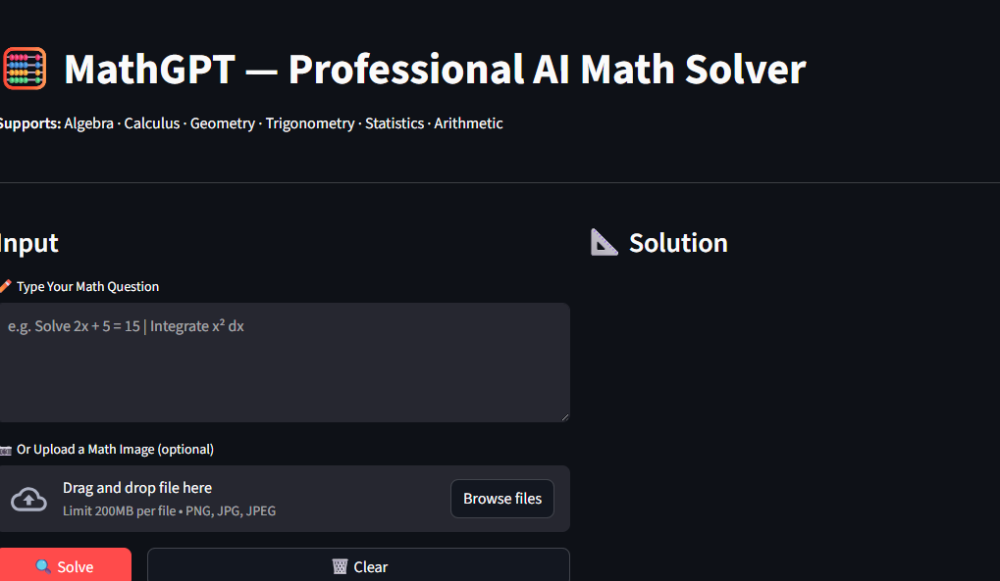
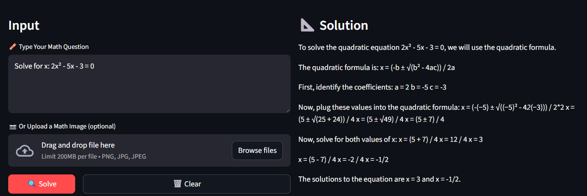
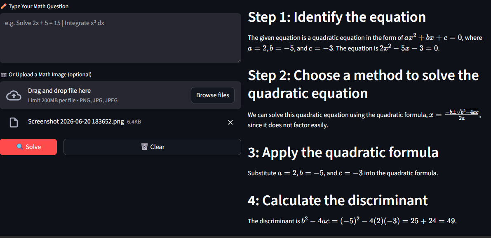
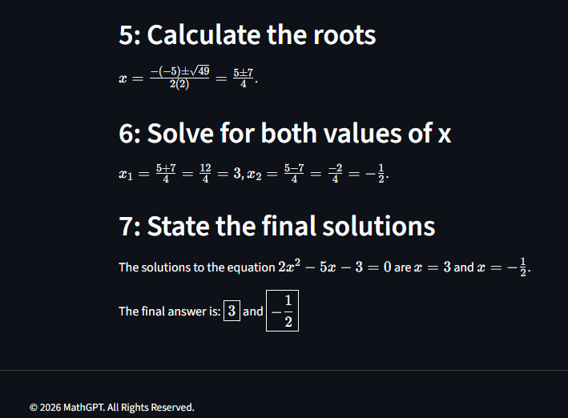
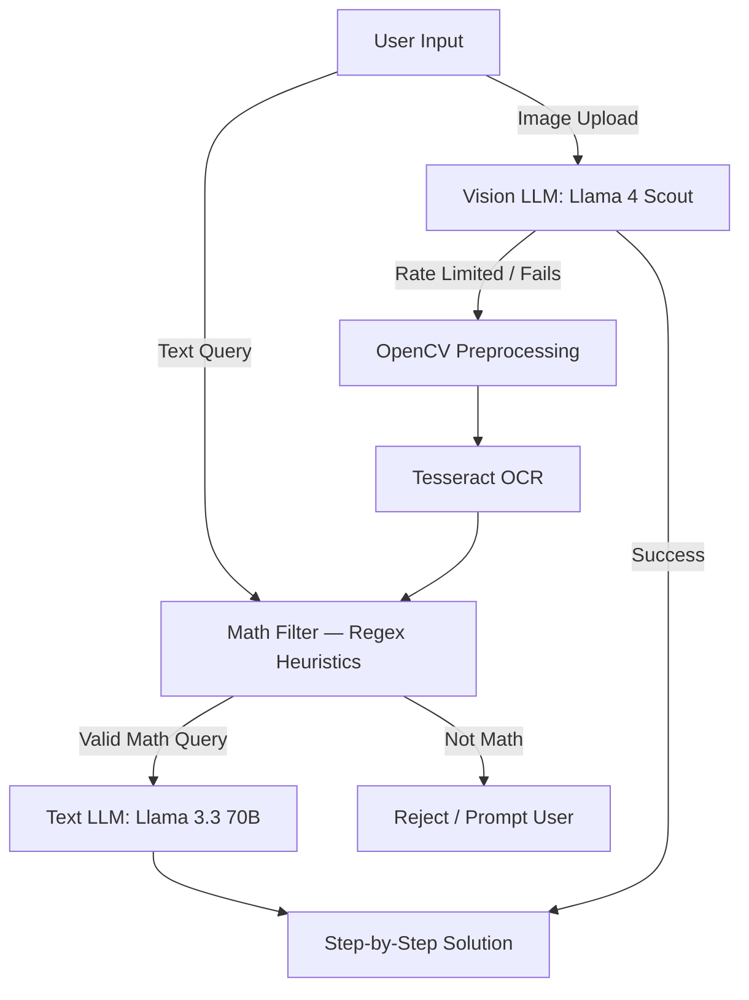

<div align="center">

# 🧮 MathGPT — Professional AI Math Solver

### AI-Powered Mathematical Problem Solver & Tutor

*Multi-modal AI tutor that solves handwritten and typed math problems with step-by-step pedagogical explanations.*

**Supports:** Algebra · Calculus · Geometry · Trigonometry · Statistics · Arithmetic

[](https://www.python.org/)
[](https://streamlit.io/)
[](https://groq.com/)
[](LICENSE)
[](https://github.com/jawad-hua/MathGPT/stargazers)
[](https://github.com/jawad-hua/MathGPT/issues)

[Features](#-key-features) • [Demo](#-demo) • [Installation](#-installation--setup) • [Usage](#-usage) • [Architecture](#%EF%B8%8F-architecture--tech-stack) • [Contributing](#-contributing)

</div>

---

## 📖 Overview

**MathGPT** is an advanced, multi-modal AI application that acts as an expert mathematics tutor. Built on a split-model architecture powered by the **Groq Inference Engine**, it instantly processes both handwritten/printed images and complex textual math equations to deliver structured, step-by-step pedagogical solutions — not just final answers.

Whether a student uploads a photo of a textbook problem or types out an algebraic equation, MathGPT identifies the right solving strategy, walks through the derivation, and presents a clear final result.

---

## 🎬 Demo

<div align="center">

### Clean, Distraction-Free Interface


### Instant Text-Based Solving


### Detailed Step-by-Step Breakdown



</div>

> 📁 Save the screenshots into a `docs/` folder in the repo root with the filenames above (`screenshot-home.png`, `screenshot-text-solve.png`, `screenshot-steps-1.png`, `screenshot-steps-2.png`) so they render correctly on GitHub.

---

## 🚀 Key Features

| Feature | Description |
|---|---|
| 🖼️ **Multi-Modal Input** | Accepts raw text queries *or* image uploads (photos of equations, word problems, handwritten work). |
| ⚡ **Dual-Engine Processing** | State-of-the-art vision LLMs handle direct image comprehension, with an autonomous text-based fallback for reliability. |
| 🔁 **Robust OCR Fallback Pipeline** | OpenCV-based preprocessing (grayscale conversion, cubic upscaling, denoising, adaptive thresholding) paired with Tesseract OCR ensures uptime if primary vision APIs hit rate limits. |
| 🧠 **Intelligent Math Filter** | Regex-driven heuristic classification ensures only math-related queries reach the LLM, protecting compute resources from arbitrary/off-topic input. |
| 📐 **Pedagogical Step-by-Step Explanations** | Enforces systematic derivation, variable identification for word problems, and a clearly highlighted final answer. |

---

## 🛠️ Architecture & Tech Stack

| Layer | Technology |
|---|---|
| **Frontend UI** | [Streamlit](https://streamlit.io/) — Python-native reactive dashboard framework |
| **Inference Engine** | [Groq Cloud API](https://groq.com/) — ultra-low-latency LLM hosting |
| **Text Solver LLM** | Meta Llama 3.3 70B Versatile *(low temperature for deterministic precision)* |
| **Vision Solver LLM** | Meta Llama 4 Scout 17B (16e-Instruct) |
| **Computer Vision / OCR** | OpenCV (`cv2`) + PyTesseract |

### How It Works



---

## 💻 Installation & Setup

### Prerequisites

- Python 3.10 or higher
- [Tesseract OCR](https://github.com/tesseract-ocr/tesseract) installed on your system
- A [Groq API Key](https://console.groq.com/keys)

### 1. Clone the Repository

```bash
git clone https://github.com/jawad-hua/MathGPT.git
cd MathGPT
```

### 2. Create a Virtual Environment (recommended)

```bash
python -m venv venv
source venv/bin/activate      # On Windows: venv\Scripts\activate
```

### 3. Install Dependencies

```bash
pip install -r requirements.txt
```

### 4. Install Tesseract OCR

| OS | Command |
|---|---|
| **Ubuntu/Debian** | `sudo apt install tesseract-ocr` |
| **macOS** | `brew install tesseract` |
| **Windows** | Download installer from [UB-Mannheim/tesseract](https://github.com/UB-Mannheim/tesseract/wiki) |

### 5. Configure Your API Key

Create a `.streamlit/secrets.toml` file in the project root:

```toml
GROQ_API_KEY = "your_groq_api_key_here"
```

> ⚠️ This file is already listed in `.gitignore` — never commit your real API key.

### 6. Run the Application

```bash
streamlit run app.py
```

The app will be available at `http://localhost:8501`.

---

## 🧑‍💻 Usage

1. Launch the app with `streamlit run app.py`.
2. Choose your input method:
   - **Text:** Type any math equation or word problem directly.
   - **Image:** Upload a photo or screenshot of a handwritten/printed problem.
3. MathGPT validates the query, routes it through the appropriate model, and returns a full step-by-step solution with the final answer clearly marked.

### Example

**Input (text):**
```
Solve for x: 2x² - 5x - 3 = 0
```

**Output:**
```
Step 1: Identify the quadratic equation in standard form ax² + bx + c = 0
        a = 2, b = -5, c = -3

Step 2: Apply the quadratic formula
        x = (-b ± √(b² - 4ac)) / 2a

Step 3: Substitute values
        x = (5 ± √(25 + 24)) / 4 = (5 ± 7) / 4

Final Answer: x = 3 or x = -1/2
```

---

## 📂 Project Structure

```
MathGPT/
├── .streamlit/
│   └── secrets.toml        # Groq API key & local secrets (gitignored)
├── app.py                  # Streamlit entry point — UI + solving logic
├── packages.txt             # System-level dependencies (e.g. tesseract-ocr)
├── requirements.txt          # Python dependencies
├── readme.md
└── .gitignore
```

> 🔒 `secrets.toml` holds your `GROQ_API_KEY` and is excluded from version control via `.gitignore`. Never commit this file.

---

## 🗺️ Roadmap

- [ ] Support for graph plotting (functions, derivatives, integrals)
- [ ] Multi-language support (Urdu/English bilingual explanations)
- [ ] Export solutions as PDF
- [ ] Conversation history & saved problem sets
- [ ] LaTeX rendering for cleaner equation display

---

## 🤝 Contributing

Contributions are welcome! To contribute:

1. Fork the repository
2. Create a feature branch (`git checkout -b feature/amazing-feature`)
3. Commit your changes (`git commit -m 'Add some amazing feature'`)
4. Push to the branch (`git push origin feature/amazing-feature`)
5. Open a Pull Request

Please make sure to update tests as appropriate and follow the existing code style.

---

## 📜 License

This project is licensed under the **MIT License** — see the [LICENSE](LICENSE) file for details.

---

## 👤 Author

**Muhammad Jawad**

[](https://github.com/jawad-hua)
[](https://linkedin.com)
[](https://kaggle.com)
[](https://huggingface.co)

---

<div align="center">

⭐ If you find this project useful, consider giving it a star on GitHub!

</div>
